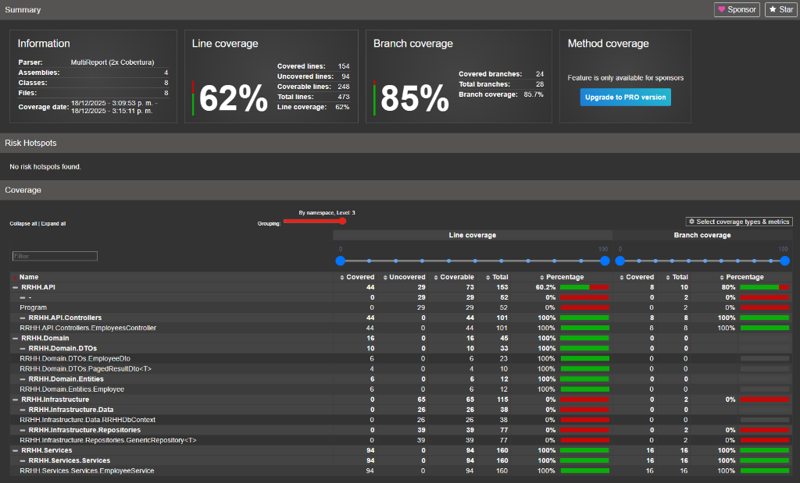

# API RRHH

Este proyecto es una API RESTful construida con **.NET 9** para la gestión de Recursos Humanos. Sigue un enfoque de **Arquitectura Limpia** (Clean Architecture) para asegurar la separación de preocupaciones, la capacidad de prueba y el mantenimiento.

## 🏗️ Arquitectura

La solución está dividida en los siguientes proyectos:

- **RRHH.Domain**: Contiene la lógica de negocio principal, entidades e interfaces. No tiene dependencias de otras capas.
- **RRHH.Application**: Define casos de uso, DTOs y lógica de aplicación.
- **RRHH.Infrastructure**: Implementa interfaces definidas en las capas de Dominio y Aplicación (ej. Acceso a Datos con EF Core, Repositorios).
- **RRHH.API**: El punto de entrada de la aplicación (Controladores, Program.cs).
- **RRHH.Services**: Servicios de negocio adicionales.
- **RRHH.Tests**: Pruebas unitarias y de integración.

## 🚀 Tecnologías

- **.NET 9**
- **Entity Framework Core 9.0.11** (SQL Server)
- **C#**

## 📊 Cobertura de Código

Nos esforzamos por mantener una alta calidad de código y cobertura de pruebas. A continuación se muestra el informe de cobertura actual:



## 🛠️ Comenzando

1.  Clona el repositorio.
2.  Navega al directorio `src/RRHH`.
3.  Configura tu cadena de conexión en `RRHH.API/appsettings.json`.
4.  Ejecuta la aplicación:
    ```bash
    dotnet run --project RRHH.API
    ```
